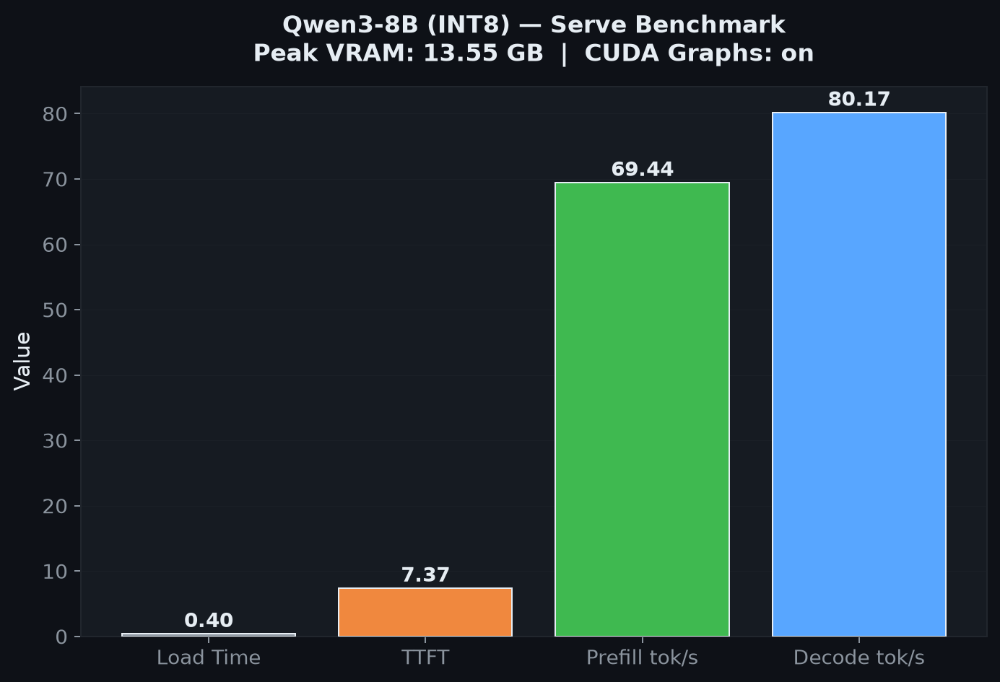

# SuperL8 Serve


**OpenAI-compatible INT8 inference server for Volta and CMP hardware.**

Most inference servers assume you have Ampere or newer. SuperL8 Serve is built from the ground up for Volta and CMP hardware — using [SuperL8](https://github.com/jajmangold/superl8)'s DP4A INT8 kernels to get real throughput on cards everyone else skipped past.

Engine design follows [nano-vllm](https://github.com/GeeeekExplorer/nano-vllm) (MIT). This is a re-implementation, not a fork — no nano-vllm source is vendored.

Drop in a GGUF checkpoint, point it at a HuggingFace model, and serve an OpenAI-compatible API. No tensor cores required.

## What's implemented

### API server

| Component | Details |
|---|---|
| `/v1/chat/completions` | OpenAI-compatible chat completions with streaming. |
| `/v1/completions` | OpenAI-compatible text completions. |
| `/v1/embeddings` | Embedding endpoint (float format). |
| `/v1/rerank` | Reranking endpoint. |
| Structured outputs | JSON schema and grammar-constrained generation via XGrammar. |
| Tool calls | Native `tool_choice="auto"` / `"required"` with Hermes/Qwen and LFM2 parsers. |
| Reasoning tokens | `reasoning_content` field in chat responses. |
| Batching API | `/v1/batches` for offline batch processing. |

### Engine

| Component | Details |
|---|---|
| Continuous batching | Dynamic request scheduling with idle coalescing. |
| CUDA graph capture | Graphed decode for consistent low-latency throughput. Bucket-tuned. |
| Paged KV cache | Memory-efficient attention with int8, k8v3, k8v8 cache formats. |
| Prefix caching | KV cache reuse across requests with shared prefixes. |
| KV eviction | LRU eviction when cache pressure exceeds budget. |
| Chunked prefill | Prefill split into configurable chunks to avoid decode starvation. |
| Decode strategies | Greedy, top-k, top-p, temperature, min-p, repetition penalty, frequency penalty. |

### Speculative decoding

| Component | Details |
|---|---|
| N-gram drafter | Chain-tree mask builder for speculative draft generation. |
| MTP head drafter | Multi-token prediction heads for draft candidates. |
| Grammar drafter | XGrammar-constrained speculative decode. |
| Tree verify | Tree-structured verification via SuperL8's `attn_tree_fwd`. |

### Model support

| Family | Prefill | Decode | Notes |
|---|---|---|---|
| Qwen3 dense/MoE | INT8 dp4a | INT8 dp4a | Full prefill + decode. |
| Gemma3 | INT8 dp4a | INT8 dp4a | Full prefill + decode. |
| GLM-4.5/4.6 | INT8 dp4a | INT8 GQA | Decode only. |
| Hunyuan | INT8 dp4a | INT8 GQA | Decode only. |
| LFM2 | INT8 dp4a | INT8 GQA | Decode only. |
| Qwen3-Next/3.5/3.6 | INT8 dp4a | INT8 GQA + DeltaNet | Hybrid architecture. |
| DeepSeek-V3/V4 | INT8 dp4a | INT8 absorb | MLA attention. |
| MiniMax-Text | INT8 dp4a | Lightning half | Lightning attention. |
| Qwen3.5-VL | INT8 dp4a | INT8 dp4a | Vision-language model. |

See `superl8serve/models/COVERAGE.md` for the full family matrix.

### Weight handling

| Component | Details |
|---|---|
| `.superl8` loading | mmap zero-copy from SuperL8's custom weight format. |
| GGUF native loading | Load Q2_K–Q6_K and IQ types directly, no conversion. |
| HF conversion | `python -m superl8serve.convert` converts any HuggingFace checkpoint. |
| Weight SQNR validation | Per-layer signal-to-quantization-noise ratio check against HF original. |

### Multi-GPU

| Component | Details |
|---|---|
| Pipeline parallelism | Split model across GPUs by layers. |
| MoE expert parallelism | Route experts to specific GPUs. |
| PCIe transport | Compression codec (int8/int4/NF4 + Hadamard rotation) for cross-GPU transfers. |
| Lowrank compression | Entropy-coded lowrank activation compression for pipeline stages. |

### Training

| Component | Details |
|---|---|
| LoRA | Low-rank adaptation with int8 base weights. |
| QLoRA | 4-bit quantized base + LoRA adapters. |
| Optimizer | Custom optimizer for quantized parameter updates. |

### Infrastructure

| Component | Details |
|---|---|
| TUI | Terminal dashboard for live metrics (throughput, VRAM, batch size). |
| Metrics | Prometheus-compatible metrics export. |
| SSRF guards | Image URL validation for VLM inputs. |
| Docker | Runtime Dockerfile with entrypoint script. |

## Install

```bash
pip install https://github.com/jajmangold/superl8-serve/releases/download/v0.1.0/superl8_serve-0.1.0-py3-none-any.whl
```

Requires [SuperL8](https://github.com/jajmangold/superl8) for the CUDA kernels.

## Quick start

```bash
python -m superl8serve.api.server \
  --model /path/to/your-model.superl8 \
  --tokenizer Qwen/Qwen3-8B
```

### Client

```python
from openai import OpenAI

client = OpenAI(base_url="http://localhost:8000/v1", api_key="unused")
resp = client.chat.completions.create(
    model="my-model",
    messages=[{"role": "user", "content": "Explain quantum computing in one sentence."}],
)
print(resp.choices[0].message.content)
```

### Docker

```bash
docker build -f docker/Dockerfile.runtime -t superl8-serve:latest .
docker run --rm --gpus all -p 8000:8000 \
  -v /path/to/models:/models:ro \
  -e SUPERL8_MODEL=/models/your-model.superl8 \
  -e SUPERL8_TOKENIZER=/models/your-tokenizer \
  superl8-serve:latest
```

## Performance

Measured on V100-labelled CMP fleet hardware:

| Model | Prefill | Decode | VRAM |
|---|---|---|---|
| Qwen3-8B | 69.5 tok/s | 80.2 tok/s | 13.5 GiB |
| Qwen3.6-27B Q3_K_S | — | 21.3 tok/s | 14.3 GiB |

See `bench/` for raw JSON benchmark data.

### Qwen3-8B throughput



## Architecture

See [docs/ARCHITECTURE.md](docs/ARCHITECTURE.md) for the full system architecture — Mermaid diagrams, data flow walkthroughs, speculative decode state machines, and design decisions.

## Roadmap

Performance improvements planned for upcoming releases:

- **Speculative decode pipeline** — overlap draft generation with verify to hide the latency of the drafter model.
- **Multi-GPU tensor parallelism** — split individual attention heads across GPUs for models that don't fit in pipeline parallelism granularity.
- **FP8 KV cache** — for Hopper/Ada cards, use FP8 KV cache to double cache capacity vs int8.
- **FlashInfer integration** — replace hand-written attention with FlashInfer for Ampere+ cards while keeping dp4a for Volta.
- **Streaming batch scheduler** — pre-allocate KV cache pages before requests arrive to eliminate first-token latency spike.
- **Weight streaming** — load model weights from disk on-demand for models larger than VRAM.
- **Quantization-aware training (QAT)** — fine-tune with simulated INT8 to recover quality lost during post-training quantization.
- **OpenAI-compatible audio endpoints** — `/v1/audio/transcriptions` and `/v1/audio/speech` for multimodal models.

## Development

```bash
git clone https://github.com/jajmangold/superl8-serve.git
cd superl8-serve
pip install -e ".[dev,convert,serve,structured]"
ruff check .
pytest
```

Set `SUPERL8_WEIGHTS_DIR` to point at a directory containing model weight files for tests that require real checkpoints.

## Related repos

- [**SuperL8**](https://github.com/jajmangold/superl8) — the CUDA kernels that power this server. INT8 DP4A FlashAttention-2 and GEMM for Volta GPUs.
- [**ComfyUI-SuperL8**](https://github.com/jajmangold/ComfyUI-superl8) — ComfyUI nodes for INT8 quantized diffusion DiTs. Same kernels, different workload.

## License

BSD-3-Clause. See [LICENSE](LICENSE).
