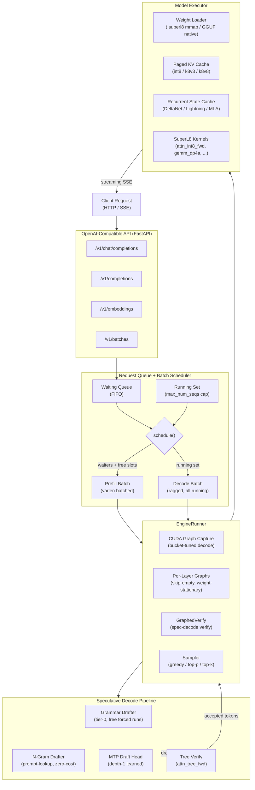
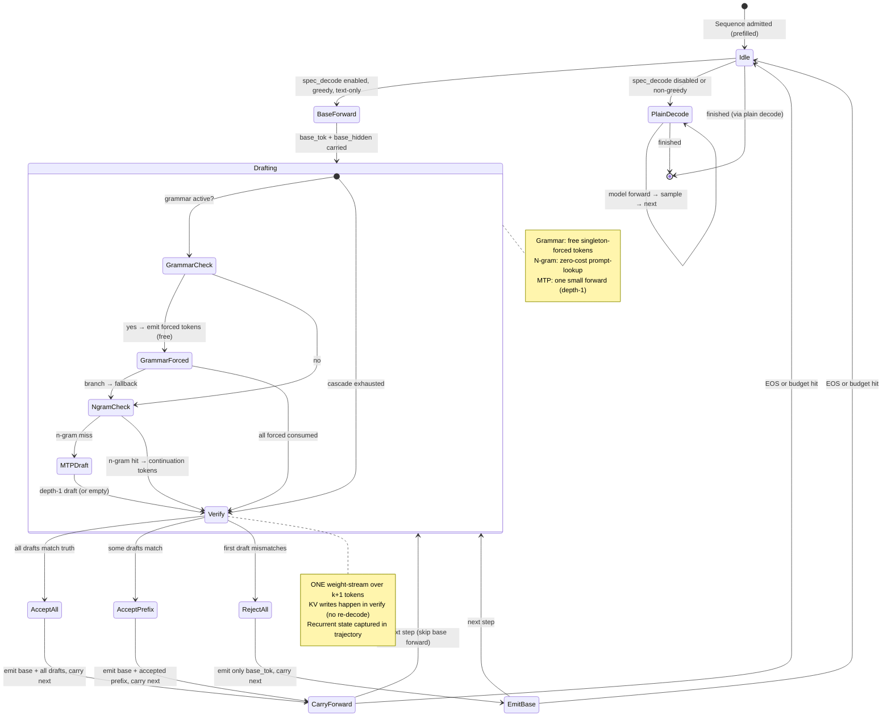

# SuperL8 Serve — System Architecture

## 1. High-Level Architecture



## 2. Data Flow: How a Tensor Moves Through the System

### 2.1 Request Arrival → First Token (Prefill)

```
1. HTTP POST /v1/chat/completions
   └─ FastAPI handler tokenizes the prompt → list[int]
   └─ engine.add_request(prompt_ids) → Sequence(seq_id, prompt_ids, SamplingParams)
   └─ Sequence enters scheduler.waiting (FIFO deque)

2. scheduler.schedule()
   ├─ Check: len(running) < max_num_seqs? free_slot? free_block? budget?
   ├─ Admit: pop from waiting → cache.alloc() → slot assigned
   ├─ Prefix cache: cache.lookup_prefix(prompt_ids) → share blocks if match
   └─ Return (batch=[seq], is_prefill=True)

3. EngineRunner.prefill(batch)
   ├─ varlen batched (if recurrent-safe): pack all sequences into one forward
   │   └─ Build cu_seqlens, slot_mapping (host-side int arithmetic, no GPU sync)
   ├─ OR sequential per-sequence (recurrent hybrids):
   │   └─ Each seq: ensure_capacity → lin_cache.bind → model(ids, pos, ctx)
   └─ Sample logits[:, -1] → first token

4. Cache write (inside model forward, per layer):
   ├─ Q/K/V projections (gemm_dp4a or gguf-native dp4a)
   ├─ Attention (attn_int8_fwd or attn_varlen_fwd)
   └─ K/V written: cache.write_prefill(layer, k, v, slot, start=prefix_matched_len)
       └─ quantize_kv_write_paged: fp16 → int8 + fp32 scale (RTN per-token)
       └─ Hadamard rotation applied to K before quantization

5. Scheduler.postprocess: seq moves from admission batch → running set
   └─ Token appended to seq.output_ids → SSE stream to client
```

### 2.2 Steady-State Decode Step

```
1. scheduler.schedule()
   └─ Return (batch=running, is_prefill=False)  — all running sequences decode together

2. EngineRunner.decode(batch)
   ├─ Try per-layer CUDA graph (GraphedDecodeLayers.try_decode)
   │   ├─ Match (batch_bucket, context_bucket) → replay captured graph
   │   └─ Miss → fall through
   ├─ Try whole-step CUDA graph (GraphedDecode.try_decode)
   │   ├─ Match → replay
   │   └─ Miss → eager fallback
   └─ Eager: model(ids=[last_token], pos=[length], ctx)

3. Inside one decode step (per layer):
   ├─ Q = proj_q(hidden)                    — gemm_dp4a [B, 1, nq*hd] × [nq*hd, H]
   ├─ K, V = proj_k(hidden), proj_v(hidden) — gemm_dp4a
   ├─ KV cache write: cache.write_decode(layer, slots, positions, k_new, v_new)
   │   └─ One quantize_kv_write_paged call for all B tokens
   ├─ Attention: attn_paged_decode_cached(q, k_cache, v_cache, block_table, context_lens)
   │   └─ ONE launch reads the entire ragged batch (variable-length contexts)
   └─ O = proj_o(attn_out) → MLP → residual → next layer

4. Sampling (outside CUDA graph):
   ├─ logits = model.compute_logits(hidden[:, -1])
   ├─ Sampler: greedy argmax or top-p/top-k/temperature
   └─ toks.tolist() — the ONE necessary device→host sync

5. Postprocess:
   ├─ seq.output_ids.append(tok), seq.length += 1
   └─ scheduler.postprocess: check EOS → free finished sequences
```

### 2.3 Speculative Decode Step

```
1. Bootstrap (first spec step for a sequence only):
   └─ Base forward: model(last_token) → base_tok, base_hidden
   └─ Carry: seq.spec_base_tok = base_tok, seq.spec_base_hidden = base_hidden

2. Draft cascade (every step):
   ├─ Grammar drafter: walk grammar forward, collect singleton-forced tokens (FREE)
   ├─ N-gram drafter: match last N tokens against history → continuation (FREE)
   └─ MTP head: depth-1 learned draft (ONE small forward)

3. Verify (ONE weight-stream over k+1 tokens):
   ├─ Build verify_ids = [base_tok, draft_1, ..., draft_k]
   ├─ Model forward over S=k+1 tokens (same kernels as decode)
   ├─ true_tokens = logits.argmax(-1) at each position
   └─ Accept longest greedy prefix: draft[i] == true_tokens[i]?

4. Commit:
   ├─ Append accepted tokens to seq.output_ids
   ├─ KV already written by verify forward (no re-decode)
   ├─ Recurrent state: commit from captured trajectory at last accepted slot
   └─ Carry next_base_tok/hidden for pipelining (skip base forward next step)
```

## 3. State Diagram: Speculative Decode Pipeline



## 4. Key Subsystems

### 4.1 Paged KV Cache

```
┌──────────────────────────────────────────────────────────┐
│  Block Pool (shared, reference-counted)                   │
│  ┌─────┬─────┬─────┬─────┬─────┬─────┬─────┬─────┐     │
│  │blk 0│blk 1│blk 2│blk 3│blk 4│blk 5│blk 6│ ... │     │
│  └──┬──┴─────┴──┬──┴─────┴──┬──┴─────┴─────┴─────┘     │
│     │           │           │                             │
│  ┌──▼──┐     ┌──▼──┐     ┌──▼──┐                        │
│  │Slot0│     │Slot1│     │Slot2│  ... (max_num_seqs)    │
│  │[0,2]│     │[1,3]│     │[4]  │                        │
│  └─────┘     └─────┘     └─────┘                        │
│                                                          │
│  Per-block storage (per layer):                          │
│    K:  [num_blocks, num_kv_heads, block_size, head_dim]  │
│        int8 + fp32 per-token scale                       │
│    V:  int8 + fp32 per-token scale (int8 format)         │
│        OR packed 3-bit Lloyd-Max codes + fp32 norms      │
│        (k8v3 format — 1.875 bytes per V weight)          │
│  Block size: 16 tokens                                   │
└──────────────────────────────────────────────────────────┘
```

- **Quantize-on-write**: K/V quantized to int8 at write time (RTN per-token symmetric). No fp16 KV is ever resident.
- **Hadamard rotation**: Applied to K before quantization for incoherence (improves quantization quality on outlier-heavy distributions).
- **Prefix caching**: Radix trie of completed prefixes. Blocks shared via refcount. LRU eviction bounded by HBM budget.
- **K8V3 format**: K stays int8. V uses 3-bit Lloyd-Max codebook quantization (1.875 bytes/V-weight vs 4 bytes int8). For 262k-context models, this is the difference between fitting and not fitting.
- **Eviction**: SnapKV / Ada-KV / DuoAttention prompt-time eviction. Recall-gated (cosine similarity check blocks eviction if quality degrades).

### 4.2 CUDA Graph System

Decode is **dispatch-bound**, not compute-bound. A 0.6B model launches ~3,200 kernels/step for ~18ms of GPU work inside a 131ms step. CUDA graphs collapse that to one `cudaGraphLaunch`.

Three graph tiers, tried in order:

| Tier | Class | Granularity | Skip-Empty | Fallback |
|------|-------|-------------|------------|----------|
| Per-layer | `GraphedDecodeLayers` | One graph per decoder layer | Yes (layers with no work skipped) | Whole-step graph |
| Whole-step | `GraphedDecode` | One graph for the full decode step | No | Eager |
| Verify | `GraphedVerify` | One graph per (batch, context, S) bucket | No | Eager verify |

**Bucket tuning**: Batch sizes rounded up to powers of 2 (1, 2, 4, 8, 16, ...). Context lengths rounded to 128-token buckets. Pad rows point at a scratch slot (allocated once, never freed) and are sliced off before sampling.

**Persistent staging**: Host-side inputs (ids, pos, context_lens, slot_mapping, block_table) are pinned host buffers filled in-place, then `non_blocking` copied into the SAME device tensor the graph captured. No per-step device allocation, no blocking H2D.

### 4.3 Speculative Decode

A three-tier cascade of drafters feeding a shared verify path:

| Tier | Drafter | Cost | Best On |
|------|---------|------|---------|
| 0 | Grammar (XGrammar) | FREE (no model forward) | Structured output (JSON, tool calls) |
| 1 | N-gram (prompt-lookup) | FREE (table lookup) | Repetitive/verbatim spans, code |
| 2 | MTP head (learned) | One small forward | General prose |

**Key insight**: The cascade default is `mtp` (not `cascade`) because measured on V100/Qwen3.5-9B, cascade's n-gram tier preempts better MTP drafts on prose (arXiv:2312.11462 Theorem 4.5: static "cheap first" ordering is provably suboptimal when the cheap drafter's acceptance rate is lower).

**Verify path**: ONE weight-stream over S = k+1 tokens. KV writes happen inside verify (no re-decode). Recurrent state (DeltaNet, short-conv) captured in trajectory and committed at the last accepted slot. Bit-identical to plain greedy decode.

**Gating**: Spec decode engages only when ALL conditions hold: at least one drafter exists, all sequences are greedy (temp 0), no image inputs, no repetition penalty, recurrent layers support state capture.

### 4.4 Weight Loading

Two native paths:

| Source | Method | Notes |
|--------|--------|-------|
| `.superl8` | mmap zero-copy | SuperL8's custom format. `consume_on_merge()` pops source rows during QKV merge to bound transient memory (27B fits one 16 GB card). |
| GGUF (Q2_K–Q6_K, IQ types) | Native fused dp4a | K-quant super-blocks stay resident in native layout. GEMM kernel unpacks to int8 in registers/smem and runs `__dp4a` inline. No offline conversion, no per-forward fp32 dequant. |

**Multi-GPU**: Expert weights placed on owning GPU at load time (`expert_device` in GGUF loader). Shared tensors on the primary device. No blanket `.to(device)` that would collapse the shard.

## 5. Key Design Decisions

### Why dp4a, not tensor cores or IMMA?

On CMP 100-210 (sm_70) hardware:
- FP16 tensor cores (HMMA): 6.9 TFLOP/s (firmware-limited)
- INT8 `__dp4a` on CUDA cores: **46 TOP/s** (6.7× faster)
- IMMA: doesn't exist until Turing

`dp4a` is not a compromise — it's the correct primitive. The entire kernel library is built on this instruction.

### Why int8 KV cache, not fp16?

- **Memory**: int8 = 1 byte/weight vs fp16 = 2 bytes. Halves KV cache footprint.
- **Bandwidth**: Decode is memory-bound on KV reads. int8 halves the bytes read per attention head.
- **Quality**: Quantize-on-write (RTN per-token symmetric) with Hadamard rotation is near-lossless. SQNR gating validates per-layer.
- **K8V3**: For very long contexts (262k), V uses 3-bit Lloyd-Max to fit on a single card. Tradeoff: slightly lower V quality for 4× V compression.

### Why paged KV, not pre-allocated?

- **Memory efficiency**: A short sequence (100 tokens) only pins 7 blocks (112 tokens) instead of reserving a max_len-sized region.
- **No internal fragmentation**: Blocks are shared across all sequences. Finished blocks return immediately.
- **Prefix caching**: Shared blocks are refcounted. Multiple requests with the same system prompt share physical KV storage.

### Why continuous batching, not static?

Static batching waits for the longest sequence in the batch to finish. Continuous batching admits new requests as soon as a slot opens. Under mixed-length workloads, continuous batching has 3-5× higher aggregate throughput.

### Why CUDA graphs for decode?

Decode is a fixed-shape loop (one token per sequence per step). The overhead isn't compute — it's dispatch. A 0.6B model spends 113ms launching 3,200 kernels for 18ms of actual work. CUDA graphs collapse the launches to one `cudaGraphLaunch`, bringing step time closer to the compute floor.

## 6. Known Limitations and Failure Modes

1. **MoE models cannot use CUDA graphs**: Expert routing uses `mask.nonzero()` (data-dependent), which cannot be captured. Falls back to eager decode.

2. **Sliding-window attention cannot use CUDA graphs**: The fallback path (`PagedKVCache.read_dense` + python loop) is data-dependent. Only full-attention and linear/recurrent layers are capturable.

3. **Latent attention (MLA / DeepSeek) not yet graph-capturable**: Reads a per-step-growing latent slice from `MLALatentCache`. Deferred as a separate optimization.

4. **Spec decode + vision is disabled**: MTP × vision was the interaction that broke in llama.cpp. Text-only spec path enforced.

5. **PCIe 1.0 x1 kills tensor parallelism**: ~250 MB/s wire bandwidth makes TP a net loss. Multi-GPU uses pipeline parallelism + MoE expert parallelism instead.

6. **Recurrent hybrids + spec decode memory pressure**: On a nearly full 27B load, the verify trajectory for recurrent state can exceed free memory. A `mem_get_info` gate disables spec decode proactively.

7. **KV eviction + K8V3 format**: The compact path (dequantize → requantize) is not implemented for the packed 3-bit V layout. Eviction is int8-only.

8. **Graph capture cap**: Maximum 32 captured graphs (each pins workspace). Under extreme batch/context diversity, the cap is hit and steps fall back to eager.
